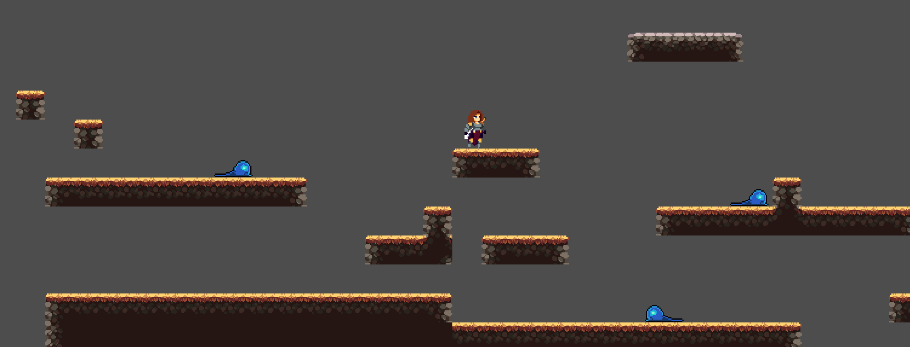

# Ambre

**Ambre** is a 2D pixel-art action-platformer developed with **[Godot 4](https://godotengine.org/)**. Currently in the prototype phase, the project implements core platforming mechanics (running, jumping) and a combat system against basic enemies.

> [!NOTE]
> Originally a personal initiative to create a **2D pixel-art platformer**, this project has been integrated into my **2nd-year engineering project at [Polytech Dijon](https://polytech.ube.fr) (2025-2026)**.

## Table of Contents
1. [Features](#features)
2. [Controls](#controls)
3. [Installation](#installation)
4. [Project Architecture](#project-architecture)
5. [Credits](#credits)

## Features

- **Core Movement:**
    - Smooth movement (Left/Right) with friction handling.
    - Jumping physics with gravity management.
- **Combat System:**
    - **Melee Attack:** Player attack animation with specific hitbox toggling logic.
    - **Enemy AI:** Basic slime using patrol behavior with RayCasts to detect edges and walls.
- **Level Design:**
    - Tilemap-based environment using a dedicated Tileset for ground and platforms.
- **Game Loop:**
    - **Death & Respawn:** The player dies upon contact with a Slime or by falling off the map, triggering an automatic respawn after a short delay.

## Controls

The game supports Keyboard controls.

| Action | Key |
| :--- | :---: |
| **Move** | <kbd>←</kbd> <kbd>→</kbd> or <kbd>A</kbd> <kbd>D</kbd> |
| **Jump** | <kbd>Z</kbd> <kbd>↑</kbd>|
| **Attack** | <kbd>A</kbd> |

## Installation

> [!NOTE]
> You need **Godot Engine 4** to edit or run the source code directly.

1.  **Download the project:**
    - Download the ZIP file via the green **Code** button.
2.  **Import into Godot:**
    - Open Godot 4.
    - Click **"Import"** and select the `project.godot` file in the folder.
3.  **Run:**
    - Press Play ▶️ on the main scene.

## Project Architecture

The project follows a modular structure where resources are sorted by type:

📂 **assets/**

Contains all raw media files organized by category:
* `characters/`: Spritesheets for the Player, ennemies and NPC's.
* `tilesets/` & `background/`: Graphics used to build the levels and environments.
* `decorations/` & `loot/`: visual elements for props and collectibles.
* `ui/` & `audio/`: User interface assets and sound effects.

📂 **scenes/**

Contains the **Nodes** and pre-fabricated objects (`.tscn`). This includes the `Player`, `Slime`, `World` (levels).

📂 **scripts/**

Contains all **GDScript logic** (`.gd`). The logic is separated from the scene files to keep the code modular (e.g., `player.gd`, `slime.gd`).

## Credits & License

This project was created for **educational and non-profit purposes**. It is not intended for commercialization.

- **Code & Development:** [Nicolas Defour](https://github.com/Craftsman0001)
- **Engine & Technology:** Developed with **[Godot 4](https://godotengine.org/)**. The project focuses on mastering **[GDScript](https://docs.godotengine.org/en/stable/tutorials/scripting/gdscript/gdscript_basics.html)**, the Node system, and 2D physics architecture.
- **Graphics Assets:** Pixel Art assets retrieved for free from [itch.io](https://itch.io/). All rights belong to their respective creators.
